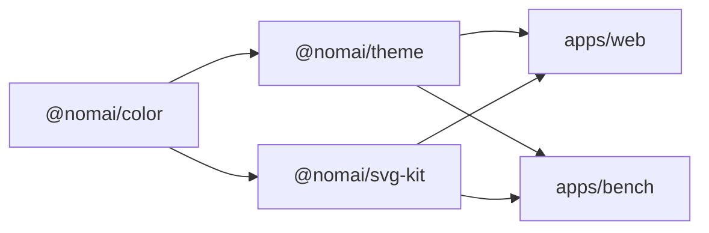
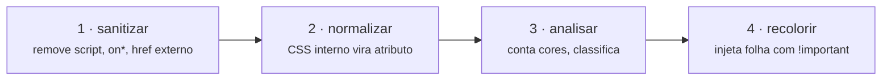

# Íris

> Ferramenta web onde o cliente sobe **o próprio logo** e testa combinações de cor aplicadas a um mockup de site real — header, hero, botões, cards, favicon — com checagem de contraste WCAG ao vivo.
>
> Um produto da **Nomai Code**. Roda 100% no navegador: nenhum arquivo sai da máquina de quem usa.

---

## 🎯 O problema

A pergunta que o cliente faz é **"essa paleta combina com a minha marca?"**.

Ela não dá pra responder olhando pra paleta sem o logo, nem pro logo sem contexto. Um verde neon lindo num seletor de cores vira texto ilegível num botão; um logo que funciona no cartão de visita some no favicon de 16px. Só dá pra decidir vendo as duas coisas juntas, aplicadas.

## ✨ O diferencial

O mercado tem as duas metades separadas — e ninguém junta:

| Ferramenta | Paleta ao vivo | Aceita seu logo | Classifica o SVG |
|---|:---:|:---:|:---:|
| Realtime Colors | ✅ | ❌ | ❌ |
| PaletteMaker | ✅ | ❌ | ❌ |
| Logo Lab | ❌ | ✅ | ❌ |
| **Íris** | ✅ | ✅ | ✅ |

O terceiro item é o que ninguém faz: **o Íris analisa o arquivo enviado e decide sozinho o que fazer com ele.** Conta as cores reais (inclusive as escondidas em CSS interno), detecta o preto implícito de quem não declara `fill`, sinaliza gradiente e bitmap embutido — e já aplica o padrão certo.

> **A interface nunca pergunta.** Ela classifica, aplica o padrão e oferece um interruptor de duas posições, já na posição correta, pro usuário discordar se quiser. O cliente não sabe o que é um SVG e não pode ser obrigado a saber.

---

## 🚀 Rodando localmente

**Pré-requisitos:** Node `24.11.1` (fixado em `.nvmrc`) e pnpm.

```bash
nvm use            # ou fnm use — lê o .nvmrc
npm i -g pnpm      # corepack precisa de admin no Windows; isso não
pnpm install
```

```bash
pnpm dev           # o produto        → http://localhost:5173
pnpm dev:bench     # bancada do pipeline → http://localhost:5199
pnpm test          # 111 testes
pnpm typecheck
```

As duas portas são `strictPort`: se estiver ocupada, o Vite falha em vez de escorregar pra outra silenciosamente.

> **`pnpm dev:bench`** sobe uma ferramenta de desenvolvimento, **não o produto**. Ela carrega o corpus de fixtures, aceita um arquivo qualquer e mostra original × recolorido lado a lado, com os tons ajustáveis. Serve pra inspecionar o pipeline sem passar pela UI.

---

## 📁 Estrutura do repositório

```
packages/
  color/      @nomai/color     parse, conversão, luminância, contraste — sem DOM
  theme/      @nomai/theme     paleta → tokens → CSS; as opiniões de produto sobre cor
    data/     brand.json · presets.json · fonts.json
  svg-kit/    @nomai/svg-kit   importar / classificar / recolorir símbolo
    fixtures/ corpus de referência — usado pela suíte E pela bancada
apps/
  web/        o produto (React + Vite)
  bench/      bancada do pipeline (ferramenta de dev)
```

Dependência de **sentido único**, sem ciclo:



### As regras que sustentam isso

**`color` e `theme` não conhecem DOM.** O `tsconfig` dos dois deixa a lib `DOM` de fora — encostar em `document` reprova no typecheck, não na revisão.

**`svg-kit` não importa `DOMParser`, recebe.** A costura fica em `adapters/dom.ts`. O mesmo código roda no navegador hoje e no servidor no dia em que arquivos começarem a ser gravados.

**Nenhum literal de cor, fonte ou limiar nas apps.** Tudo vem de `@nomai/theme`. Um `#16DB65` dentro de um componente React é bug.

**pnpm, não npm workspaces** — pela fronteira, não pela velocidade. O npm achata todas as dependências na raiz, e aí `svg-kit` conseguiria `import React` sem declarar. Com pnpm isso é erro de resolução. *(Dependência instalada na raiz ainda vaza pra todos, porque o Node sobe os diretórios — por isso dependência mora no pacote que a usa.)*

---

## 🧩 O pipeline de símbolo

A parte mais difícil e a que tem mais valor. Quatro etapas, em `packages/svg-kit`:



**1 · Sanitizar** — SVG é XML executável. Remove `<script>`, `<foreignObject>`, atributos `on*` e qualquer `href` externo. Só sobrevive `#id` e bitmap em `data:`. *(`data:image/svg+xml` fica de fora de propósito: um SVG aninhado carrega script junto.)*

**2 · Normalizar** — resolve as regras do `<style>` interno contra os elementos e transforma em atributos, respeitando a cascata de verdade: atributo de apresentação tem especificidade zero e perde pra qualquer regra CSS; entre regras de mesma especificidade, vence a última. Depois desta etapa toda cor mora num lugar só, independente da ferramenta que exportou o arquivo.

**3 · Analisar** — conta cores distintas, detecta o preto implícito da spec, sinaliza `<image>` embutida, gradiente e `viewBox` ausente. Em bitmap, amostra o canal alfa. Classifica em `mono` · `duo` · `multi` · `raster` · `raster-opaque`.

**4 · Recolorir** — cada elemento ganha a classe do seu tom e um `<style>` é injetado **dentro** do SVG. Reescrever o arquivo com regex não funciona: quebra em classe CSS, em style inline e no caso do fill implícito.

### O que a suíte trava

| Caso | Esperado |
|---|---|
| `fill="#000"` num `<g>` pai | mono → segue o tema |
| Classe CSS interna (`.st0{fill:#231F20}`, padrão Illustrator) | mono → segue o tema |
| `style="fill:#0a0a0a"` inline | mono → segue o tema |
| Sem `fill` nenhum (preto implícito da spec) | mono → segue o tema |
| Duas cores | duo → dominante vira brand, segunda vira accent |
| Três cores | multi → mantém as cores originais |
| `<image>` embutida (PNG disfarçado de SVG) | aviso, sem recolorir |
| `<script>` e `onload` | sanitizado, não executa |
| PNG opaco | aviso, opção de colorir bloqueada |
| PNG com alfa | colorido por máscara CSS |

Os fixtures moram em `packages/svg-kit/fixtures/`, fora de `test/`: são corpus de referência, lidos pela suíte **e** pela bancada, então os dois não divergem no próximo caso descoberto.

---

## 🎨 Tokens e contraste

O usuário edita **sete** tokens: `brand` · `accent` · `bg` · `surface` · `text` · `muted` · `line`.

`@nomai/theme` deriva mais **quatro**, e é aqui que mora a inteligência do produto:

| Token | O que é |
|---|---|
| `onBrand` / `onAccent` | preto ou branco — o que contrastar mais |
| `brandSoft` | fundo de pílula e ícone: a marca misturada ao fundo |
| `brandInk` | **a marca empurrada até virar texto legível** |

`brandInk` existe porque **a cor da marca quase nunca serve como texto**. O verde `#16DB65` dá 1.85:1 contra branco — ilegível. `ensureContrast` caminha a luminosidade em passos até bater 4.5:1 contra o fundo em que a cor vai aparecer, escurecendo em fundo claro e clareando em fundo escuro, preservando matiz e saturação. Sem isso, marca neon vira texto ilegível.

Os onze tokens saem de **uma função só**, que alimenta o mockup **e** o CSS exportado — o arquivo que o cliente baixa reproduz exatamente o que ele viu na tela.

---

## 🧪 Testes

```bash
pnpm test
```

| Pacote | Testes | Ambiente |
|---|---:|---|
| `@nomai/color` | 32 | Node puro |
| `@nomai/theme` | 25 | Node puro |
| `@nomai/svg-kit` | 54 | happy-dom |

**Regra:** o pipeline não muda sem os fixtures correspondentes. Caso novo descoberto = fixture novo + teste, junto com a correção.

O que a suíte **não** alcança é comportamento de pintura — que o navegador respeite a cascata da folha injetada. Isso é verificado na bancada, contra o DOM real.

---

## 📐 Convenções

**Idioma** — UI e documentação em pt-BR; código, nomes e commits em inglês.

**Commits** — Conventional Commits no título; corpo em prosa explicando o *porquê*, agrupado por área.

**Constantes — três tipos, três lugares.** Jogar tudo num arquivo de config produz o problema oposto ao hardcode: um config com 60 entradas que ninguém entende.

| Tipo | Onde | Exemplo |
|---|---|---|
| Especificação | `svg-spec.ts`, constante junto do uso | WCAG 4.5:1, namespace SVG, preto implícito |
| Botão de ajuste | `config.ts` do pacote | piso de alfa, razões de mistura, passo da busca |
| Dado de produto | `data/*.json` | presets, pilhas de fonte, a marca da casa |

*Exceção deliberada:* as allowlists da sanitização ficam em `security.ts`, **não** em `config.ts`. Afrouxar aquilo é decisão de segurança e tem que custar abrir um arquivo com esse nome e ler o porquê.

**Vidro quebrado** — ao tocar em código e notar algo meia-boca, avisar explicitamente em vez de consertar fora do escopo.

---

## ⚖️ Licenças e legal

**Repositório privado, sem arquivo `LICENSE`.** Sem licença declarada vale *todos os direitos reservados* — que é exatamente o que queremos.

**Dependências:** MIT, BSD e Apache-2.0 são aceitáveis. **AGPL é proibida** — obriga abertura do código para quem usa via rede, exatamente o caso de um SaaS. Qualquer licença fora dessa lista precisa de aprovação antes de entrar.

**Não copiar código do Realtime Colors.** O repositório deles está sob CC BY-NC-ND, que proíbe uso comercial e derivação. Usar o site como referência de produto é legítimo; copiar implementação contamina o nosso código.

---

## 🔒 Privacidade

**Nada sai do navegador do usuário — e isso é argumento de venda, não detalhe técnico.** Não existe servidor: o build gera arquivos estáticos servidos por CDN. Não há pra onde mandar o logo de ninguém.

Qualquer feature que quebre isso precisa ser decisão consciente, não efeito colateral.

> ⚠️ A sanitização de SVG no cliente protege **quem envia**, não quem recebe. Se um dia arquivos passarem a ser gravados e servidos para outras pessoas, eles têm que passar por DOMPurify/SVGO **no servidor** antes da gravação.

---

## 🗺 O que vem a seguir

- [ ] **Variante compacta do símbolo pro favicon** — o rastro de blocos some abaixo de ~24px
- [ ] **Rasterização real do favicon** — hoje o preview escala o SVG por CSS, então não reproduz o que o navegador faz em 16px
- [ ] **ESLint** — com `import/no-extraneous-dependencies`, que fecha mecanicamente a regra de dependência da raiz
- [ ] **Teste de browser** (Playwright) pro que a suíte em Node não alcança
- [ ] **Exportar o logo recolorido** — hoje dá pra baixar a paleta, não o símbolo

Quando entrar cobrança, o caminho é frontend estático + funções serverless só nas partes pagas — não um servidor inteiro. A migração é barata *desde que* a lógica de negócio nunca more dentro de componente.

---

<sub>`brand-lab_3.html` na raiz é o protótipo original: um arquivo, zero dependências, roda offline. Ele fica no repositório como **especificação executável** — quando houver dúvida sobre o comportamento esperado, é ele que responde.</sub>
